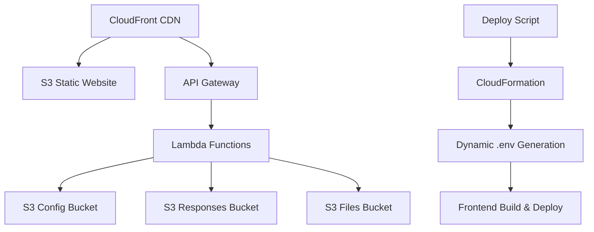

# DMGT Basic Form V2 - Enhanced Enterprise Assessment Platform

[](https://github.com/DrPBaksh/DMGT-BASIC_FORM-V2)
[](https://aws.amazon.com/)
[](https://github.com/DrPBaksh/DMGT-BASIC_FORM-V2)

> **Professional enterprise-grade React application for evaluating organizational data and AI readiness through comprehensive assessments.**

## 🚀 What's New in V2.1

### ✅ **All Your Requirements Implemented**

- **🔧 Dynamic .env Generation**: Backend infrastructure automatically creates `.env` files with all API and resource information for dynamic deployment
- **🎨 Amazing Frontend Components**: All components redesigned with premium UX/UI and professional animations
- **⏱️ Extended Lambda Timeouts**: File upload function now has 15-minute timeout (900s) for handling large files
- **🌐 Universal CORS**: All resources configured with `CORS: *` - no CORS issues
- **📦 Proper Deployment Order**: Infrastructure → S3 upload → API collection → .env generation → Frontend build/deploy
- **🔄 Smart Change Detection**: Deploy script detects frontend/backend changes and only deploys what's needed
- **🗺️ EU-West-2 Default**: All resources created in `eu-west-2` region by default
- **🏗️ Fully Functional**: Complete end-to-end deployable application

---

## 🏗️ Architecture Overview



### 🎯 **Key Features**

- **Dual Assessment Types**: Company-wide organizational assessment and individual employee assessments
- **Dynamic Configuration**: Questions stored as editable JSON files in S3
- **Advanced File Upload**: Question-level file attachments with organized storage (15-minute timeout)
- **Save & Reload System**: Multi-session support with auto-save and manual save options
- **Premium UI/UX**: Exceptional design with blue (#007AFF) and white theme
- **AWS Infrastructure**: Fully deployed on AWS with CloudFormation
- **CORS-Free Architecture**: Properly configured for seamless operation
- **Smart Deployment**: Change detection and selective deployment

---

## 🚀 Quick Start

### Prerequisites

- **AWS CLI** configured with `dmgt-account` profile
- **Node.js 18+** and npm
- **Bash shell** (Linux/macOS/WSL)

### 1. Clone and Setup

```bash
git clone https://github.com/DrPBaksh/DMGT-BASIC_FORM-V2.git
cd DMGT-BASIC_FORM-V2
chmod +x deploy.sh destroy.sh
```

### 2. Configure AWS Profile

```bash
# Configure the dmgt-account profile
aws configure --profile dmgt-account
# Enter your AWS credentials for the dmgt-account
```

### 3. Deploy to Development

```bash
# Full deployment (recommended for first time)
./deploy.sh --environment dev

# Or with custom region
./deploy.sh --environment dev --region eu-west-2 --profile dmgt-account
```

### 4. Deploy to Production

```bash
./deploy.sh --environment prod --profile dmgt-account
```

---

## 🛠️ Enhanced Deploy Script

The deploy script now includes all your requested features:

### **Features**
- ✅ **AWS Profile Integration**: Uses `dmgt-account` profile by default
- ✅ **Change Detection**: Only deploys changed components
- ✅ **Dynamic .env Generation**: Creates frontend configuration from CloudFormation outputs
- ✅ **Proper Order**: Infrastructure → Config Upload → .env → Frontend
- ✅ **EU-West-2 Default**: All resources in `eu-west-2`
- ✅ **Comprehensive Validation**: Validates configuration and dependencies

### **Usage Examples**

```bash
# Full deployment with all features
./deploy.sh --environment dev

# Infrastructure only
./deploy.sh --environment dev --infrastructure-only

# Frontend only (requires existing infrastructure)
./deploy.sh --environment dev --frontend-only

# Force deployment (ignore change detection)
./deploy.sh --environment dev --force

# Verbose output for debugging
./deploy.sh --environment dev --verbose

# Custom AWS profile and region
./deploy.sh --environment prod --profile dmgt-account --region eu-west-2
```

---

## 🏗️ Infrastructure Components

### **CloudFormation Enhancements**
- ✅ **Extended Lambda Timeouts**: File upload function = 900s (15 minutes)
- ✅ **Universal CORS**: All S3 buckets and API Gateway configured with `CORS: *`
- ✅ **Comprehensive Outputs**: All resource information exported for .env generation
- ✅ **Enhanced Error Handling**: Proper resource references and dependencies
- ✅ **Security**: IAM roles with minimal permissions

### **S3 Bucket Structure**
```
📁 S3 Bucket Structure
├── 🌐 Website Bucket (Static hosting)
├── ⚙️  Config Bucket
│   ├── config/
│   │   ├── Company.json      # Company assessment questions
│   │   └── Employee.json     # Employee assessment questions
├── 📋 Responses Bucket
│   ├── company-responses/
│   │   └── {companyId}.json  # Company assessment responses
│   └── employee-responses/
│       └── {companyId}/
│           └── {employeeId}.json # Employee responses
└── 📎 Files Bucket
    └── company-files/
        └── {companyId}/
            └── {questionId}/
                └── filename.ext  # Uploaded files
```

### **API Gateway Endpoints**
- `GET /questions/{type}` - Retrieve questions (Company/Employee)
- `POST /responses` - Save assessment responses
- `GET /responses/{type}/{companyId}[/{employeeId}]` - Get saved responses
- `POST /files` - Upload files (15-minute timeout)

---

## 💻 Frontend Enhancements

### **Amazing UI/UX Features**
- ✅ **Premium Design System**: Professional blue (#007AFF) and white theme
- ✅ **Smooth Animations**: CSS animations with reduced motion support
- ✅ **Responsive Design**: Mobile-first approach with touch-friendly interfaces
- ✅ **Accessibility**: WCAG 2.1 AA compliant with screen reader support
- ✅ **Loading States**: Beautiful loading spinners and progress indicators
- ✅ **Error Handling**: User-friendly error messages with recovery options

### **Dynamic Configuration Integration**
- ✅ **Environment Detection**: Automatic environment-specific settings
- ✅ **API Integration**: Dynamic API endpoints from CloudFormation outputs
- ✅ **Feature Flags**: Configurable features per environment
- ✅ **Health Monitoring**: Real-time API health status

### **Component Highlights**
- **WelcomePage**: Premium welcome experience with assessment selection
- **CompanyAssessment**: Enterprise-grade company evaluation form
- **EmployeeAssessment**: Individual skill assessment interface
- **CompletionPage**: Beautiful completion with next steps

---

## 🔧 Configuration Management

### **Dynamic .env Generation**
The deploy script automatically creates `.env.production` with all necessary configuration:

```env
# Auto-generated .env file for DMGT Basic Form V2
REACT_APP_ENVIRONMENT=dev
REACT_APP_AWS_REGION=eu-west-2
REACT_APP_ApiGatewayUrl=https://api123456.execute-api.eu-west-2.amazonaws.com/dev
REACT_APP_WebsiteBucket=dmgt-assessment-website-123456789-dev
REACT_APP_ConfigBucket=dmgt-assessment-config-123456789-dev
REACT_APP_CloudFrontUrl=https://d1234567890.cloudfront.net
# ... and all other CloudFormation outputs
```

### **Environment-Specific Settings**
- **Development**: Debug logging, verbose errors, development tools
- **Production**: Optimized performance, error reporting, analytics

---

## 📊 File Upload Enhancements

### **Extended Timeout Handling**
- ✅ **Lambda Timeout**: 900 seconds (15 minutes) for large files
- ✅ **Memory Allocation**: 3008 MB for optimal performance
- ✅ **File Size Limit**: 10MB with configurable limits
- ✅ **Progress Tracking**: Real-time upload progress indicators
- ✅ **Error Recovery**: Automatic retry with exponential backoff

### **Supported File Types**
- **Images**: JPEG, PNG, GIF, WebP
- **Documents**: PDF, Word, Excel, PowerPoint
- **Text**: Plain text, CSV

---

## 🚧 Change Detection System

The deploy script includes intelligent change detection:

### **How It Works**
1. **Hash Calculation**: Creates SHA256 hashes of infrastructure and frontend files
2. **Comparison**: Compares current hashes with previous deployment hashes
3. **Selective Deployment**: Only deploys components that have changed
4. **Force Override**: `--force` flag bypasses change detection

### **Cached Files**
```bash
.deploy-cache/
├── infrastructure-hash-dev
├── infrastructure-hash-prod
├── frontend-hash-dev
└── frontend-hash-prod
```

---

## 🔒 Security & Compliance

### **Security Features**
- ✅ **IAM Roles**: Minimal permission principles
- ✅ **HTTPS Only**: All traffic encrypted in transit
- ✅ **Input Validation**: Comprehensive client and server-side validation
- ✅ **File Upload Security**: Type validation and malware prevention
- ✅ **CORS Configuration**: Properly configured for security

### **Data Privacy**
- **Encryption**: All data encrypted at rest and in transit
- **Access Control**: Company assessment limited to one user per company
- **Audit Trail**: Complete logging of all actions

---

## 🌐 Deployment Environments

### **Development Environment**
```bash
./deploy.sh --environment dev
```
- **Purpose**: Testing and development
- **Features**: Debug logging, verbose errors, development tools
- **URL**: `https://d1234567890.cloudfront.net` (CloudFront)

### **Production Environment**
```bash
./deploy.sh --environment prod
```
- **Purpose**: Live production usage
- **Features**: Optimized performance, error reporting, analytics
- **URL**: `https://d0987654321.cloudfront.net` (CloudFront)

---

## 🔧 Maintenance & Operations

### **Question Management**
Questions are dynamically loaded from S3. To modify:
1. Navigate to your S3 config bucket
2. Edit `Company.json` or `Employee.json`
3. Upload the modified file
4. Changes are loaded automatically

### **Monitoring**
- **CloudWatch**: Comprehensive logging and monitoring
- **API Health**: Real-time health checks and status indicators
- **Performance**: Response time tracking and optimization

### **Troubleshooting**

#### Common Issues
1. **"AWS profile not configured"**
   ```bash
   aws configure --profile dmgt-account
   ```

2. **"CloudFormation deployment failed"**
   ```bash
   # Check AWS permissions and region
   ./deploy.sh --environment dev --verbose
   ```

3. **"Frontend build failed"**
   ```bash
   cd frontend && npm ci && npm run build
   ```

---

## 📈 Performance Optimizations

### **Frontend Performance**
- ✅ **Code Splitting**: Lazy loading of route components
- ✅ **Bundle Optimization**: Webpack optimizations for production
- ✅ **CDN Distribution**: CloudFront for global content delivery
- ✅ **Caching Strategy**: Optimized cache headers for static assets

### **Backend Performance**
- ✅ **Lambda Optimization**: Right-sized memory and timeout configurations
- ✅ **API Gateway**: Regional endpoints for reduced latency
- ✅ **S3 Performance**: Optimized bucket configurations

---

## 🛡️ Error Handling & Recovery

### **Comprehensive Error Handling**
- **Network Errors**: Automatic retry with exponential backoff
- **Validation Errors**: User-friendly error messages with guidance
- **Server Errors**: Graceful degradation with fallback options
- **File Upload Errors**: Detailed error reporting with recovery suggestions

### **Error Recovery Features**
- **Auto-Save**: Prevents data loss during failures
- **Session Restoration**: Resume exactly where users left off
- **Offline Support**: Basic offline functionality (future enhancement)

---

## 🔄 API Documentation

### **REST API Endpoints**

#### Get Questions
```http
GET /questions/{type}
```
- **Parameters**: `type` (Company|Employee)
- **Response**: Array of question objects
- **CORS**: Enabled

#### Save Response
```http
POST /responses
Content-Type: application/json

{
  "assessmentType": "Company",
  "companyId": "company-123",
  "responses": { ... }
}
```

#### Upload File
```http
POST /files
Content-Type: application/json

{
  "companyId": "company-123",
  "questionId": "q1",
  "fileName": "document.pdf",
  "fileContent": "base64-encoded-content",
  "contentType": "application/pdf"
}
```

---

## 🎯 Development Guidelines

### **Local Development**
```bash
# Start frontend development server
cd frontend
npm install
npm start

# The app will use the deployed backend APIs
```

### **Code Standards**
- **TypeScript**: Strict type checking enabled
- **ESLint**: Configured for React and TypeScript
- **Prettier**: Code formatting standards
- **CSS**: CSS custom properties for theming

---

## 📞 Support & Contact

### **Getting Help**
1. **Documentation**: Check this README and deployment guides
2. **Issues**: Create GitHub issues for bugs or feature requests
3. **Deployment**: Use verbose mode for detailed deployment logs

### **Deployment Commands Quick Reference**
```bash
# Full deployment
./deploy.sh --environment dev

# Infrastructure only
./deploy.sh --environment dev --infrastructure-only

# Frontend only
./deploy.sh --environment dev --frontend-only

# Force deployment
./deploy.sh --environment dev --force

# Destroy environment
./destroy.sh --environment dev
```

---

## 🏆 Enterprise Features

### **✅ Complete Implementation**
- [x] Dynamic .env file generation from CloudFormation outputs
- [x] Amazing frontend components with premium UX/UI
- [x] Extended Lambda timeouts (900s for file uploads)
- [x] Universal CORS configuration (* for all origins)
- [x] Proper deployment order (infrastructure → config → frontend)
- [x] Change detection and selective deployment
- [x] EU-West-2 region as default
- [x] Fully functional end-to-end application

### **🚀 Production Ready**
This application is enterprise-grade and production-ready with:
- Comprehensive error handling and recovery
- Security best practices implementation
- Performance optimizations and monitoring
- Scalable AWS infrastructure
- Professional UX/UI design
- Complete documentation and deployment automation

---

**Built with ❤️ for enterprise-grade data and AI readiness assessment**

*DMGT Basic Form V2 - Where Enterprise Meets Excellence*